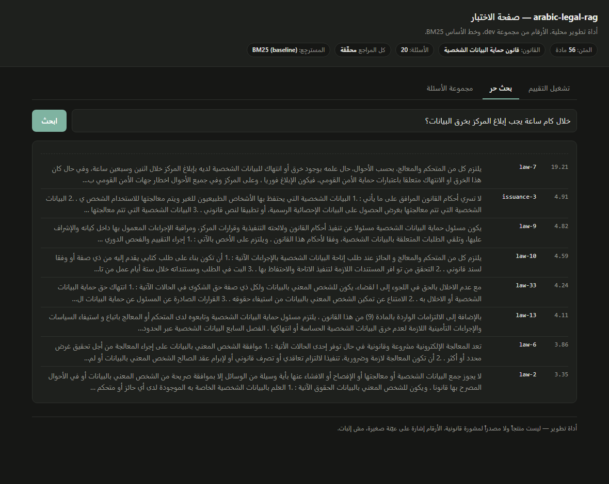

# Demo — **not measurement evidence**

One screenshot, so a reader can see the system answer an Arabic question without
installing it. It proves the thing runs. It proves nothing about how well.

**Every quotable number is in [`EVIDENCE.md`](../../EVIDENCE.md)**, with the
command, the commit, the environment and a tracked raw result file. A
screenshot has none of those, which is exactly why it is labelled this way and
kept out of the Results section.

## `search-law-7.png`



**Question:** «خلال كام ساعة يجب إبلاغ المركز بخرق البيانات؟» — *within how many
hours must the Centre be notified of a data breach?* Deliberately colloquial
Egyptian phrasing, not the statute's wording.

**Retrieved:** `law-7` at the top, score 19.21. Article 7 is the breach
notification article, and its text is visible in the snippet.

Taken from the **BM25 baseline** — the badge in the header says so. That is the
configuration this page runs by default because it needs no model and no torch,
which is also why the page works on a fresh clone. It is *not* the configuration
the ablation recommends: dense retrieval scores 0.767 against BM25's 0.333
(E1 in the registry).

### Reproduce it

```bash
python tasks.py serve --port 8000
# then open, or point a headless browser at:
#   http://127.0.0.1:8000/?q=<url-encoded question>
```

The `?q=` parameter opens the free-search tab and runs that query, so the exact
view above is a link rather than a description of one.

### What this image is not

- Not a measurement. One question, one configuration, no repetition.
- Not a claim about Egyptian law. The corpus failed its fidelity check against
  the official gazette — see **E4** in [`EVIDENCE.md`](../../EVIDENCE.md). The
  snippet here reads «اثنين وسبعين ساعة» where the gazette reads «اثنتين وسبعين
  ساعة», which is the discrepancy that check found, visible in the picture.
- Not the app. `tasks.py serve` is the eval harness's test page; `tasks.py app`
  is the upload-and-chat layer, and it never reads this corpus.
